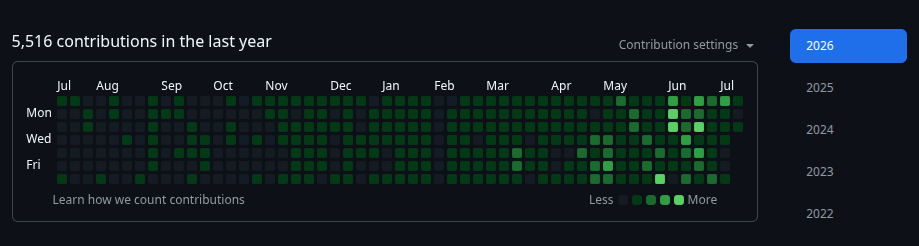

# Hi, I'm Rakib Mirza 👋

# 🚀 Principal AI Engineer | Solution Architect | Distributed Systems Engineer

> ### 🧠 **Engineering AI that engineers software.**
>
> ### ⚡ **Built mission-critical software for global enterprises. Now building AI that builds software.**

---

## 👨‍💻 About Me

Principal AI Engineer and Solution Architect at **Tata Consultancy Services (TCS)** with **15+ years** of experience designing, building and delivering mission-critical distributed systems for some of the largest UK and EU retail and e-commerce enterprises.

Today I'm building an **Enterprise Agentic AI Harness** that enables autonomous AI agents to understand, reason, collaborate and automate complex software engineering workflows—from code understanding and architecture generation to implementation, testing and deployment.

I remain a deeply hands-on engineer who enjoys solving difficult engineering problems across AI, distributed systems, cloud-native platforms and software architecture.

---

## 🌍 Engineering at Scale

Over the past 15+ years, I've helped deliver enterprise platforms serving millions of customers across some of the UK's and Europe's largest retailers.

| 🎯 Strategy | 🏗️ Architecture | 💻 Engineering | 🚀 Operations |
|-------------|-----------------|----------------|---------------|
| Product Discovery | Solution Architecture | Hands-on Development | Production Deployment |
| Technical Strategy | Domain Modeling | Distributed Microservices | Production Support |
| Technology Selection | Event-driven Systems | Cloud-native Applications | Site Reliability |
| Business Analysis | API-first Design | Platform Engineering | Observability |
| Engineering Leadership | Cloud Architecture | CI/CD Automation | Performance Optimization |
| Engineering Mentorship | System Design | Code Reviews | Continuous Evolution |

### 💡 What I enjoy most

- 🏗️ Architecting large-scale distributed systems
- 💻 Writing production-grade code
- 🤖 Building enterprise AI platforms
- 👨‍🏫 Mentoring engineers for the AI-native software engineering era

---

## 🤖 Currently Building

# Enterprise Agentic AI Harness for Software Engineering

An enterprise platform enabling autonomous AI agents to collaborate across the complete Software Development Lifecycle.

| 🧠 AI Engineering | ⚙️ Agent Capabilities |
|------------------|-----------------------|
| Multi-Agent Orchestration | Software Engineering Agents |
| Context Engineering | Large Repository Understanding |
| Agent Memory | AI Planning & Reasoning |
| Human-in-the-loop | Long-running Agent Workflows |
| RAG | Secure Enterprise AI |
| AI Governance | LLM Evaluation |
| AI Observability | AI Platform Engineering |

---

## 💻 Technical Expertise

| 🤖 AI Engineering | ☕ Backend | ☁️ Cloud & Platform | 🔄 Distributed Systems | 🏛️ Architecture |
|------------------|-----------|---------------------|------------------------|-----------------|
| Enterprise Agentic AI | Java | AWS | Apache Kafka | Cloud Native |
| Multi-Agent Systems | Python | Azure | AWS Kinesis | MACH Architecture |
| LLM Engineering | Spring Boot | Kubernetes | EventBridge | Event-Driven |
| AI Orchestration | FastAPI | Docker | SNS | API-First |
| Context Engineering | Node.js | Terraform | SQS | CQRS |
| RAG | REST APIs | GitHub Actions | Redis | Event Sourcing |
| MCP | GraphQL | GitLab CI/CD | PostgreSQL | High Availability |
| Bedrock | Microservices | Jenkins | DynamoDB | Scalability |
| OpenAI | Domain Driven Design | Linux | Elasticsearch | Resilience |
| Anthropic | | | | |
| Hugging Face | | | | |
| LangGraph | | | | |
| Google ADK | | | | |

---

## 🔬 Current Focus

| 🤖 AI & Agents | 💻 Software Engineering | ☁️ Platform |
|---------------|--------------------------|-------------|
| Enterprise Agentic AI | Autonomous SDLC | AI Platform Engineering |
| Multi-Agent Collaboration | AI Code Understanding | AI Infrastructure |
| Long Context Reasoning | Developer Productivity | AI Governance |
| Context Engineering | AI-assisted Development | LLM Evaluation |
| Agent Memory | Software Engineering Automation | AI Observability |

---

## 🧠 Engineering Philosophy

> **Great AI systems are built on great software engineering.**

✔️ Build systems, not demos.

✔️ Stay hands-on.

✔️ Keep architecture simple.

✔️ Engineer for reliability.

✔️ Optimize for maintainability.

✔️ Never stop learning.

---

## 📂 What You'll Find Here

| 🤖 AI | 🏗️ Engineering | ☁️ Cloud |
|-------|----------------|----------|
| Enterprise Agentic AI | Software Architecture | Cloud Native |
| AI Harnesses | Distributed Systems | Kubernetes |
| Multi-Agent Systems | Backend Engineering | AWS |
| AI Infrastructure | Platform Engineering | Azure |
| Research Prototypes | Developer Tooling | DevOps |
| LLM Engineering | Production-grade Systems | CI/CD |

---

## 🔒 Repository Notice

> Most of my repositories are intentionally **private** to protect enterprise confidentiality, intellectual property, production-grade source code, and ongoing research from automated AI scraping.
>
> Public repositories represent only a small subset of my engineering work and open-source experiments.

---

## 📈 GitHub Activity

Although most of my engineering work is maintained in private repositories, GitHub still reflects my ongoing development activity.

  

## 🤝 Let's Connect

I enjoy discussing:

| 🤖 AI | 🏗️ Architecture | ☁️ Cloud |
|-------|-----------------|----------|
| Enterprise AI | Software Architecture | AWS |
| Agentic AI | Distributed Systems | Azure |
| Multi-Agent Systems | Backend Engineering | Kubernetes |
| LLM Engineering | Platform Engineering | Cloud Native |
| AI Infrastructure | Microservices | DevOps |

---

> ## 🚀 **From distributed systems to distributed intelligence. Engineering the next generation of autonomous software development.**

---

⭐ **Always Learning • Always Building • Always Shipping**
